# User Guide

**Please ensure the application is deployed, instructions in the deployment guide here:**
- [Deployment Guide](./deploymentGuide.md)

Once you have deployed the solution, the following user guide will help you navigate the functions available.

| Index    | Description |
| -------- | ------- |
| [Administrator View](#admin-view)  |The administrator can register instructors, change system prompts and waiver. | 
| [Instructor View](#instructor-view)  | The instructor can view students cases and provide feedback. |
| [Student View](#student-view)  | The student can start a case, interact with AI Assistant, create summaries and transcribe audio interviews. |

All users start by filling their information at the sign up page.  

You then get a confirmation email to verify your email and are registered as a user. 

## Administrator View
Once you have an account, to become an adminstrator, you need to change your user group with Cognito through the AWS Console:

After clicking the user pool of the project, navigate to "Users" on the left navigation bar and find your email:

After clicking your email, you can add the 'admin' user group. Start by scrolling down to "Group memberships" and selecting "Add user to group".  
Select the "admin" group from available options. And lastly, confirm that the user has been added to the admin group by checking the "group attributes" of the user:

  
  

Once the 'admin' user group is added, delete the 'student' user group:

  
  

Upon logging in as an administrator, they see the following home page:

Clicking the "ADD INSTRUCTOR" button opens a pop-up where the administrator can enter the email address of a user with an account to add them as an instructor:

The administrator can also click an instructor in the list which opens a pop-up of instructor details including their name, email and students they have been assigned to. 

From here, administrators can assign students to the instructor by selecting "Add Student" dropdown and selecting the Student to be assigned. 

Once selected, click on "Assign Student" and student will be assigned to Instructor. Once assigned, the student's name will appear under the Instructor details. To unassign a student click on the "x" mark next to the student's name :

In the "AI Settings" page, the administrator can set a daily message limit for each user which will alter how many times a user can send messages to the AI Assistant:

In this page, the administrator can also edit the current system prompt and view previous system prompts which will be fed to the AI Assistant.
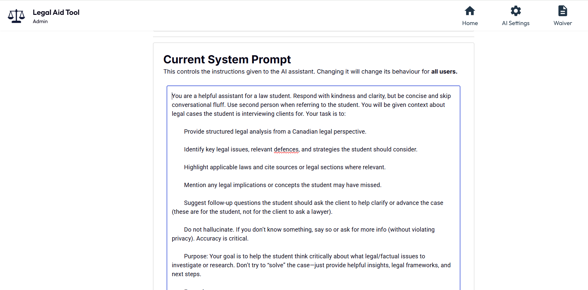

On the Waiver Page, the admin can update the waiver which will be shown to students upon first sign up:
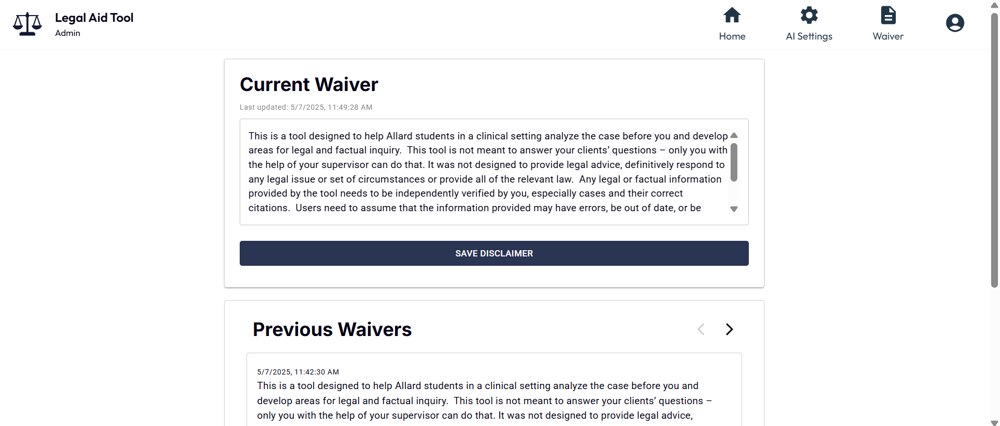

## Instructor View

Upon logging in as an instructor, you’re greeted with a homepage that displays the cases submitted for review, the total number of assigned students, and a breakdown of reviewed and pending cases.

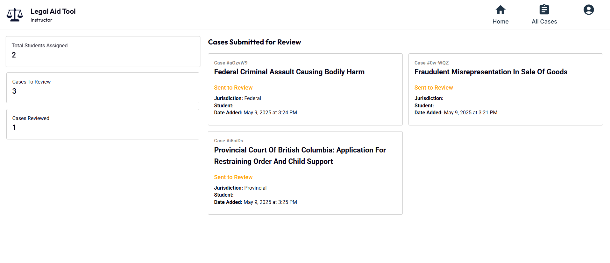

The instructor can click on total students assigned to see the names of all students. 

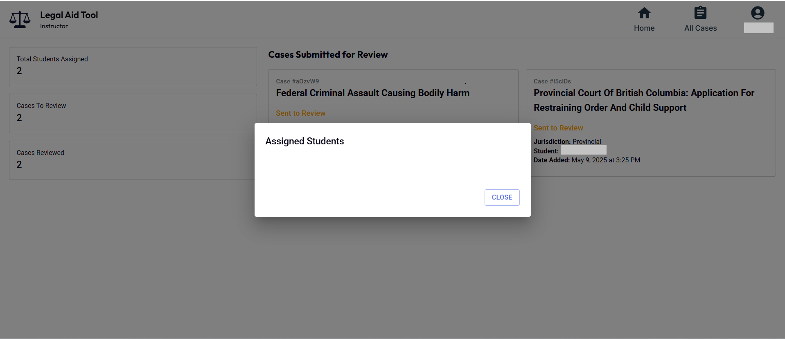

Upon clicking on any of the cases, the instructor can see all interactions of the student with the AI Assistant as well as all the summaries, notes and transcriptions. The instructor can then give feed back from the "Case Feedback" tab:
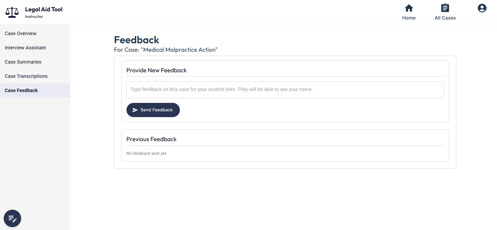

On the "All Cases" Page, the instructor can search through cases and filter cases of the students assigned to them by Student Name and Status:
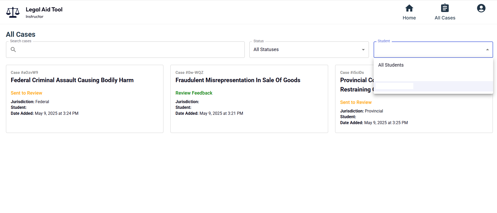

## Student View
Upon logging in as a student, they see this home page with their most recent cases and the statuses of these cases (i.e. In Progress, Sent to Review or Review Feedback)

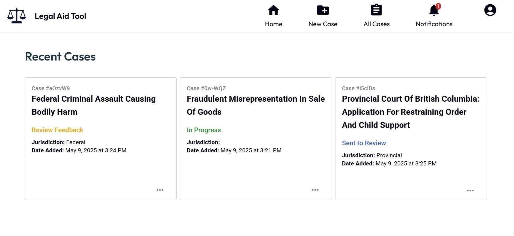

Students can click on a case and see the overview, summaries, transcriptions, notes as well as interact with the AI Assistant. 

To start a new case, students can click on the "New Case" button at the top of the screen. This page opens up a form with information the students can fill out about the jurisdiction, broad area of law and give a short description of the case which will then be sent to the AI Assistant. 

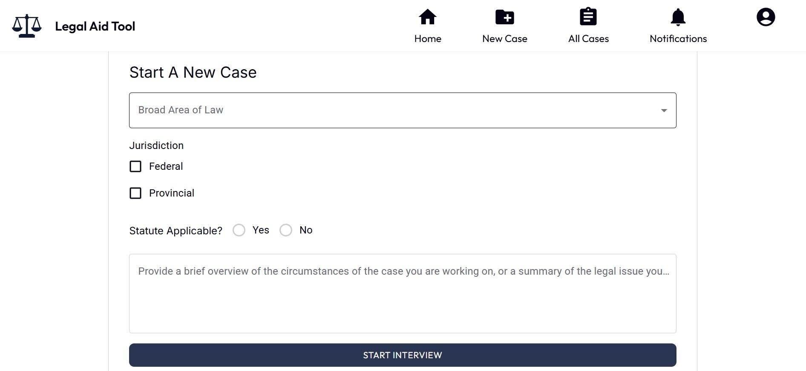

Upon creating a new case, the AI Assistant gives the student a first general summary of the case with possible next steps and follow-up questions to ask:

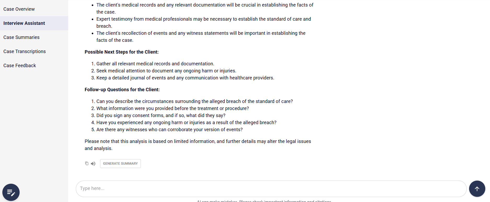

The student can also click on the notes icon at the bottom left corner, which opens up a yellow legal pad moveable notes pop-up where the students can note significant details of the particular case:

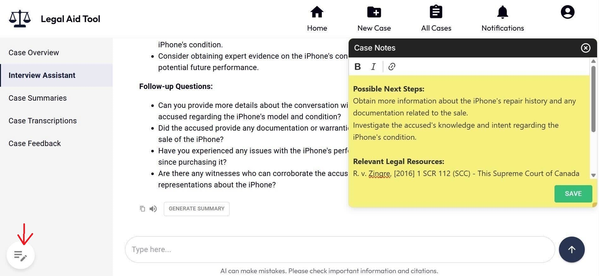

Upon interacting with the AI Assistant, the student can choose to generate a downloadable summary pdf of the information and insights from the LLM by clicking on the "Generate Summary" button below the AI message. This button then generates a downloadable pdf version of a summary which is viewable from the "Case Summaries" page:

  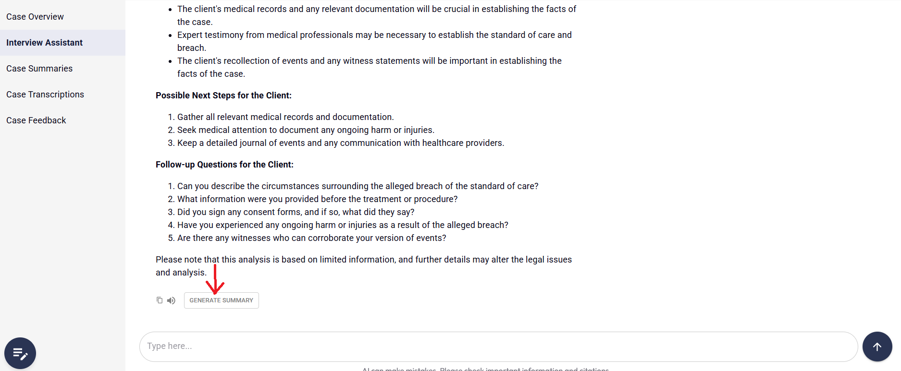
  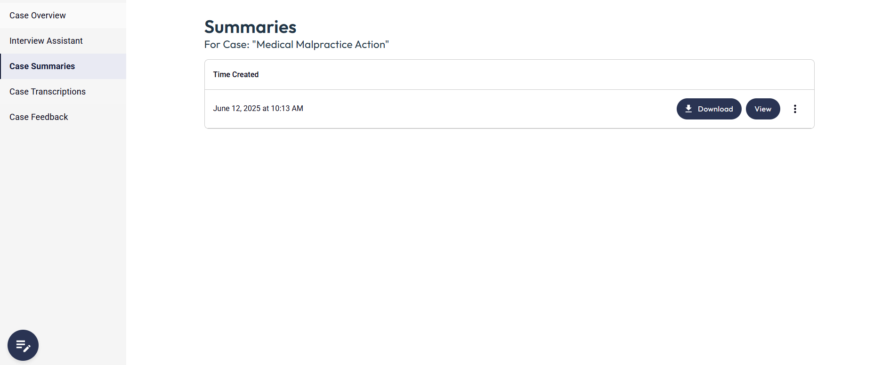

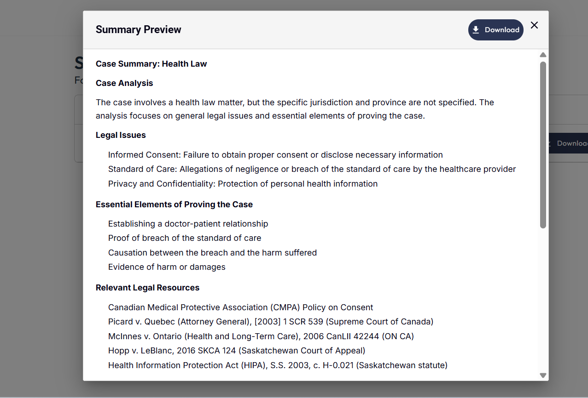

The student can also navigate to the "Case Transcriptions" tab to upload audio and transrcibe. 

  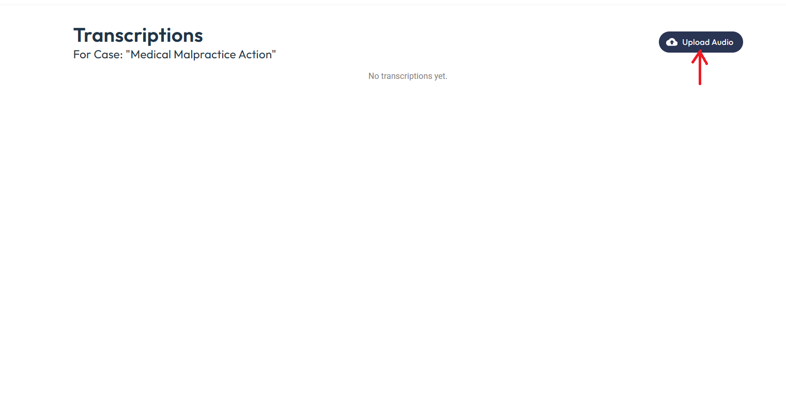
  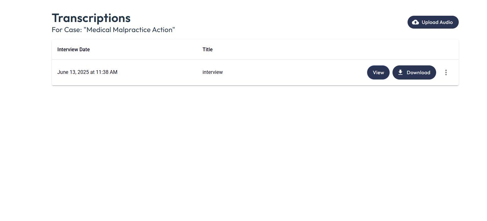

The student can choose to delete or archive a case by clicking on the 3 dots on the bottom right corner of the case box:

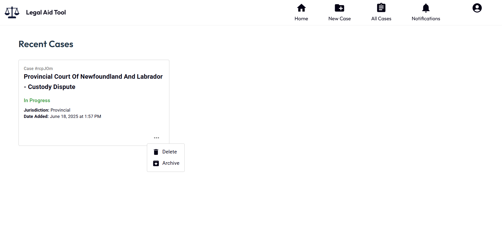

On the all cases page, students can search through cases by description or titles and view all cases including archived cases:

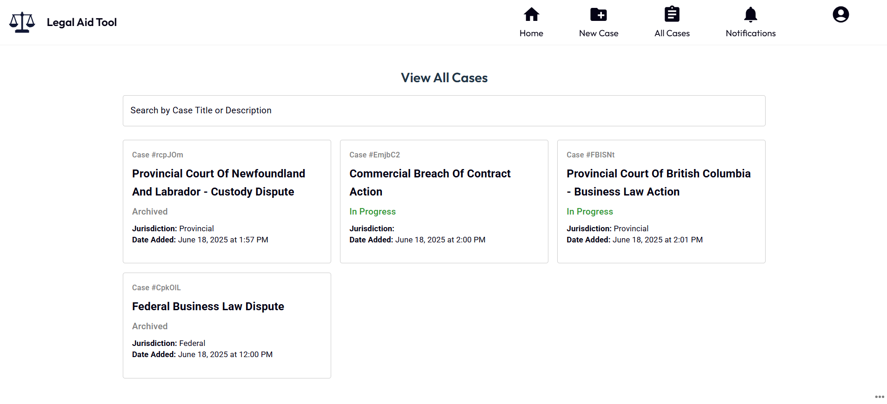