# User Guide

**Please ensure the application is deployed, instructions in the deployment guide here:**
- [Deployment Guide](./deploymentGuide.md)

Once you have deployed the solution, the following user guide will help you navigate the functions available.

| Index    | Description |
| -------- | ------- |
| [Administrator View](#admin-view)  | How the Admnistrator views the project | 
| [Instructor View](#instructor-view)  | How the Instructor/Supervising Lawyer views the project |
| [Student View](#student-view)  | How the Student views the project |

## Administrator View
To sign up as an administrator, you need to sign up regularly first as a student:
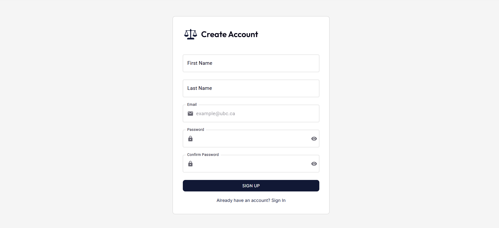

You then get a confirmation email to verify your email. Once you have a student account, to become an adminstrator, you need to change your user group with Cognito through the AWS Console:
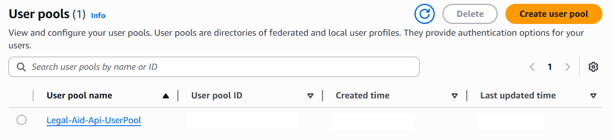

After clicking the user pool of the project, navigate to "Users" on the left navigation bar and find your email:
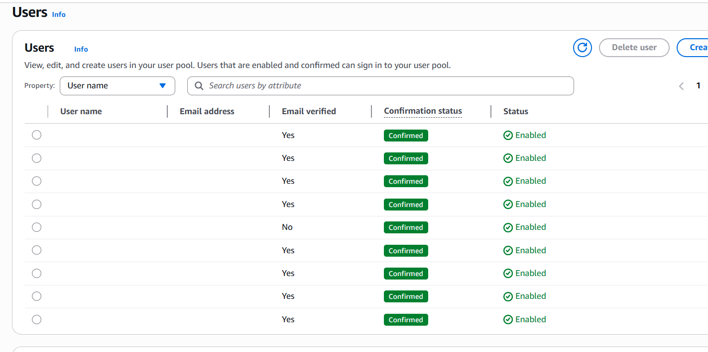

After clicking your email, you can add the 'admin' user group. Start by scrolling down to "Group memberships" and selecting "Add user to group"
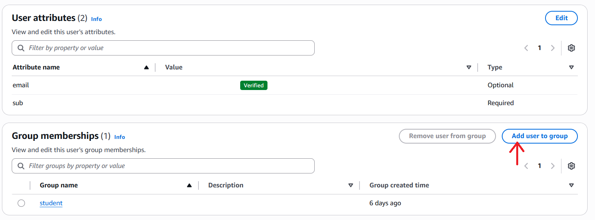
Select "admin" group from available options: 
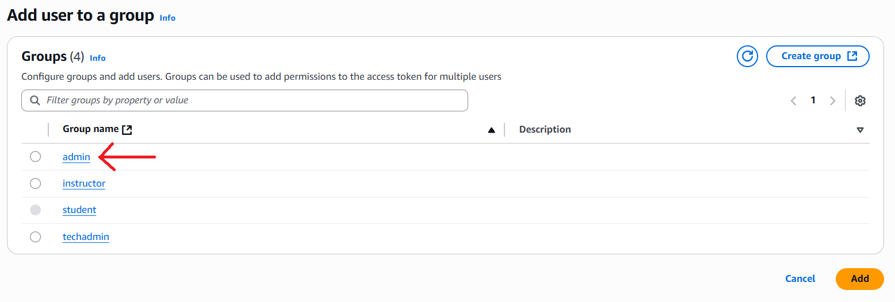
Confirm that the user has been added to the admin group by checking the "group attributes" of the user:
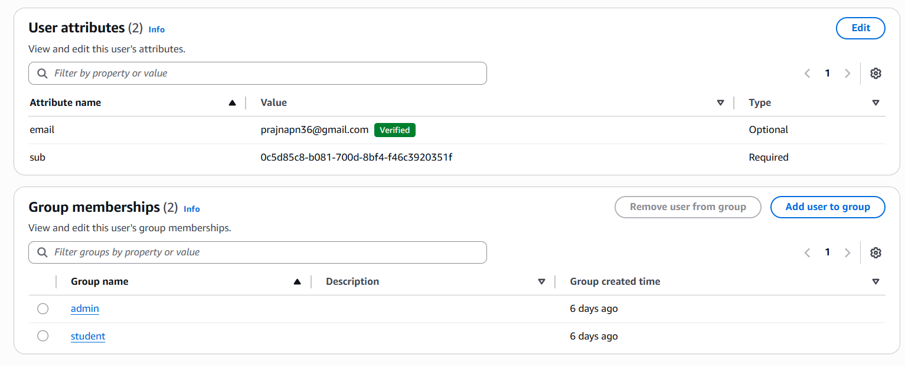

Once the 'admin' user group is added, delete the 'student' user group:
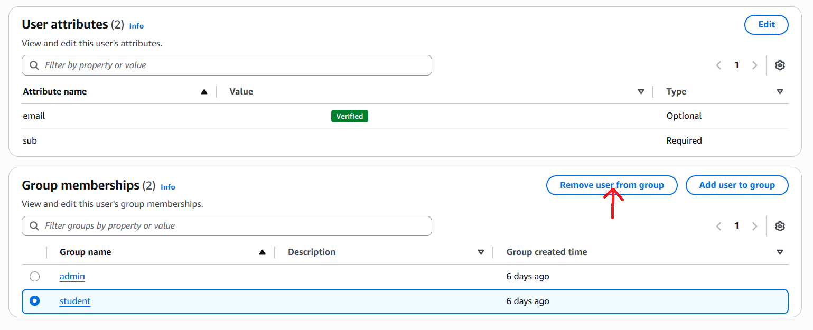
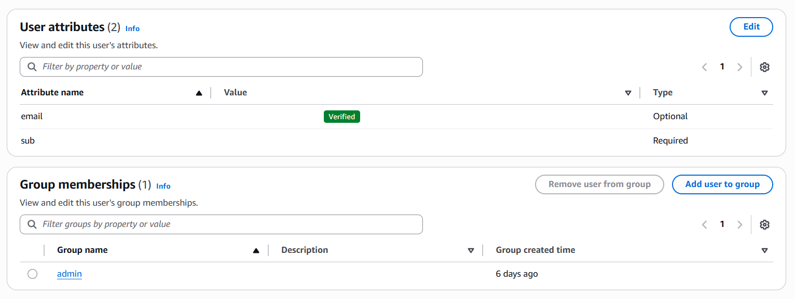

Upon logging in as an administrator, they see the following home page:
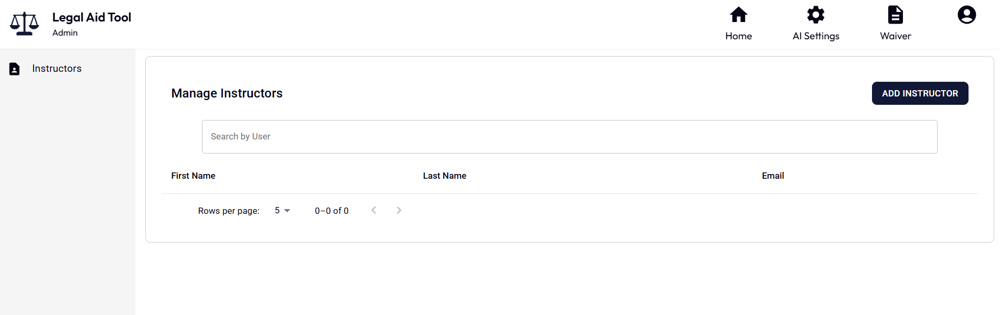

Clicking the "ADD INSTRUCTOR" button opens a pop-up where the administrator can enter the email address of a user with an account to add them as an administrator:
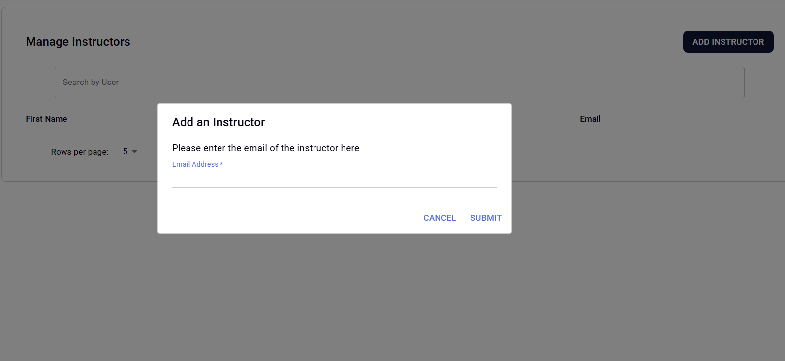

The administrator can also click an instructor in the list which opens a pop-up of instructor details including their name, email and students they have been assigned to. 
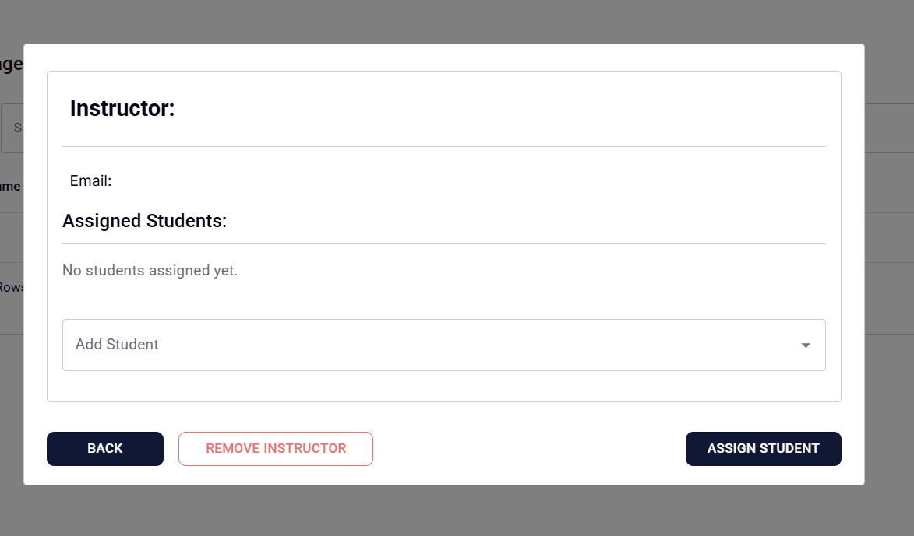

From here, administrators can assign students to the instructor by selecting "Add Student" dropdown and selecting the Student to be assigned. 
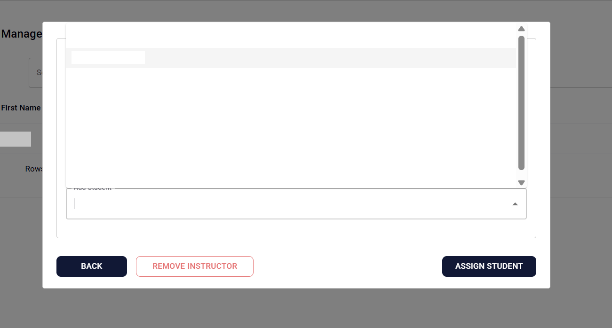
Once selected, click on "Assign Student" and student will be assigned to Instructor. Once assigned, the student's name will appear under the Instructor details. To unassign a student click on the "x" mark next to the student's name :

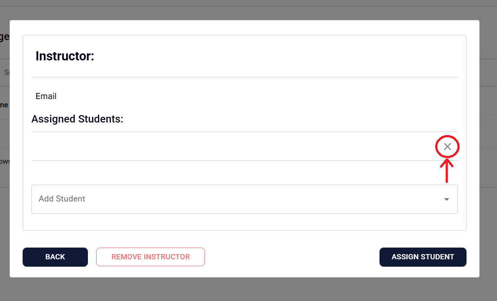

In the "AI Settings" page, the administrator can set a daily message limit for each user which will alter how many times a user can send messages to the AI Assistant:
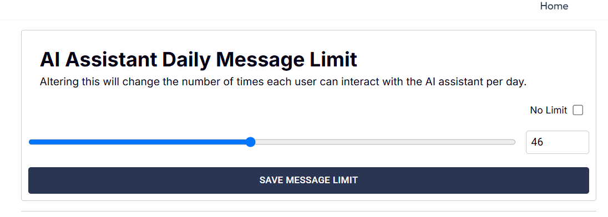

In this page, the administrator can also edit the current system prompt and view previous system prompts which will be fed to the AI Assistant.

On the Waiver Page, the admin can update the waiver which will be shown to students upon first sign up:

## Instructor View
